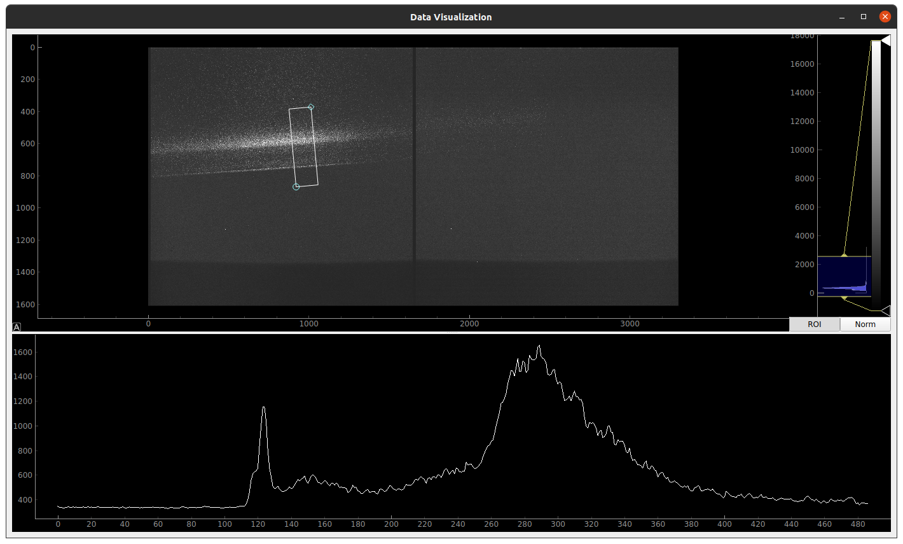

# RIXS GUI

This project aims to create a Graphical User Interface to manipulate data from RIXS experiments (Resonant inelastic X-ray scattering).

## Features

This project was developed using Python for the scripts and PyQt5 along with QtDesigner for the graphical interfaces. Some of its main features so far include:

* Loading `.h5` and `.hdf` files from RIXS experiments
* Displaying its metadata 
* Provides an interactive GUI for visualization, manipulation and processing of the experiment data (so far, this feature is exclusive to `.hdf` files).

This is a work in progress and it is expected to be further developed in the future.

## Requirements

This project has the following requirements:

* [Python](https://www.python.org/) (3.6.7 or above) for the scripts
* [PyQt5](https://pypi.org/project/PyQt5/) and pyqtgraph for the GUI
* [h5py](https://www.h5py.org/) to load `.hdf` and `.h5` files ([direct link to pypi project](https://pypi.org/project/h5py/)).

## Usage

To run the GUI and its scripts, simply clone this repository to your machine and run the following command in the terminal (inside the repository directory):

```
python fileReaderControl.py
```

This command should execute the script and open the interface, allowing the user to load and manipulate experiment files.

## Screenshots


**Image 1:** Interface with no file loaded.


**Image 2** Interface with `.hdf` file loaded, showing its metadata.


**Image 3:** Example of data and image manipulation from a loaded `.hdf` file. This interface is interactive and has a color histogram section, as well as a Region Of Interest (ROI) selector. It also displays integrated data inside the ROI.


